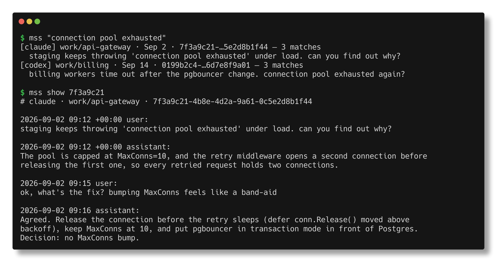

<h1 align="center">mss</h1>

<p align="center">
  <strong>No memory system needed. Just recall your AI coding history.</strong><br>
  <sub>不需要记忆系统，直接召回你的 AI 编程历史。</sub>
</p>

<p align="center">
  <a href="https://github.com/henryyu333/mss/releases/latest"></a>
  <a href="https://github.com/henryyu333/mss/actions/workflows/ci.yml"></a>
  <a href="LICENSE"></a>
  
  
</p>

<p align="center">
  <a href="README.md">English</a> · 简体中文
</p>

---

**mss 用来替代编程 Agent 的记忆系统。** Claude Code、Codex、Cursor、opencode 等 Agent 本来就把每一次会话存在你的硬盘上。mss 为这些会话记录建立索引；你在 Agent 里输入 `/mss <问题>` 时，skill 会召回相关的历史会话内容，并把它总结进当前对话，每个要点都附上会话 id、日期和逐字原文引用。

不需要记忆系统，直接召回历史就够了。没有要维护的笔记，不会在背后偷偷写"记忆"，也不会每一轮都往上下文里塞东西。历史本来就在那里；你开口时，mss 找出相关的那一段，其余时间什么都不做。

<p align="center">
  
</p>
<p align="center"><sub>截图使用的是虚构的示例会话。</sub></p>

```sh
mss index                                   # 刷新本地索引
mss "connection pool exhausted"             # 之前在哪儿遇到过？
mss show 7f3a9c21 --around 3 --brief        # 在命中位置附近读那个会话
```

### 只在本机 · 没有后台进程 · 没有 MCP · 手动召回

- **只在本机**：只读你机器上已有的文件；不联网、没有遥测、不需要账号。详见[隐私](#隐私)。
- **没有后台进程**：两次调用之间什么都不运行；没有文件监听、没有 hooks、不在后台写入。
- **没有 MCP**：就是一个普通命令行，任何 Agent 都能通过 shell 调用；不用注册，也不用保持运行。
- **手动召回**：只有你输入 `/mss` 时 skill 才会运行。没找到就说没找到，不拿相近结果冒充命中。

### 为什么用召回代替记忆系统

| | 记忆系统 | **mss** |
| --- | --- | --- |
| 知识从哪来 | Agent 自己决定要写的笔记 | **你已经有过的会话** |
| 维护成本 | 整理、删减、修正过时的笔记 | **没有，索引只是可重建的缓存** |
| 何时运行 | 每一轮，自动 | **只在你输入 `/mss` 时** |
| 什么进入对话 | 每一轮自动注入的笔记 | **被要求时，相关历史的总结** |
| 凭什么可信 | 笔记自己的措辞 | **会话 id、日期和逐字原文** |

mss 始终只是一个 binary 加一个 skill：

- **binary** 是搜索引擎；
- **[skill](skills/mss/SKILL.zh-CN.md)** 把 `/mss <问题>` 变成一次召回：刷新一次索引、搜索、读取命中的会话，把内容总结进当前对话并附上引用，同时如实说明哪些没找到、哪些没覆盖到。

## 安装

**Homebrew**（macOS、Linux）

```sh
brew install henryyu333/tap/mss
```

**预编译二进制**：从 [最新 Release](https://github.com/henryyu333/mss/releases/latest) 下载对应系统的压缩包，解压后把 `mss` 放进 `PATH`。每个压缩包里也带了 skill（英文版 `skills/mss/SKILL.md`，中文版 `skills/mss/SKILL.zh-CN.md`）。Windows 压缩包会照常构建，但未经测试。

**从源码安装**（Go 1.25+）

```sh
go install github.com/henryyu333/mss/cmd/mss@latest
```

运行时依赖：存在 SQLite 里的数据源（opencode、Cursor、Grok）通过 `sqlite3` 命令读取；zstd 压缩的记录（较新的 Codex rollout、DeepSeek Harness）通过 `zstd` 命令读取。macOS 自带 `sqlite3`，`brew install zstd` 可以补上另一个。缺少它们时 mss 照常运行，`mss doctor` 会列出读不了的数据源。

## 安装 skill

skill 负责把 `/mss` 变成一次召回。它有中英文两个版本，行为完全相同；**只装其中一个**，并统一保存为 Agent skills 目录里的 `SKILL.md`。以 Claude Code 为例：

```sh
mkdir -p ~/.claude/skills/mss

# 中文版（保存名仍然是 SKILL.md）
curl -fsSL https://raw.githubusercontent.com/henryyu333/mss/main/skills/mss/SKILL.zh-CN.md \
  -o ~/.claude/skills/mss/SKILL.md

# 或英文版
curl -fsSL https://raw.githubusercontent.com/henryyu333/mss/main/skills/mss/SKILL.md \
  -o ~/.claude/skills/mss/SKILL.md
```

其他支持 `SKILL.md` 的 Agent，把同一个文件放进它们自己的 skills 目录即可。之后明确地要历史：`/mss 当时为什么去掉了 redis 缓存`。普通对话里即使出现"之前""我们讨论过"，skill 也不会触发。

## 命令

| 命令 | 作用 |
| --- | --- |
| `mss index [--rebuild] [--quiet]` | 建立或增量更新索引 |
| `mss [search] [flags] <query>` | 搜索；可用 `--json`、`--harness`、`--project`、`--since`、`--role`、`--session`、`--limit`、`--all`、`--re`、`--no-refresh` |
| `mss search --sessions --json <query>` | 列出全部匹配会话，只含元数据：命中次数和命中消息的位置，最多 500 行。`--sort updated` 按最后更新时间从新到旧排列；`--exclude <id>`、`--exclude-self <nonce>` 会把某个会话连同它的子代理和分叉一起排除 |
| `mss show <id-prefix>` | 按结果里的 id 读取一个会话；`--around <n>` 从第 `n` 条消息附近开始读；`--brief` 每条消息一行头部（序号、角色、时间）+ 截断正文，便于快速浏览；`--no-refresh` 直接读现有索引，不先刷新 |
| `mss ctx <query\|id-prefix>` | 取最佳匹配附近的一大段上下文，方便贴进对话 |
| `mss last [n]` | 最近更新的会话 |
| `mss sources` | mss 会读的每个数据源，以及会话数和消息数 |
| `mss doctor [--json] [--deep]` | 安装情况、找到了什么、哪些没读到 |
| `mss version` | 版本信息 |

每条结果带一个 `tier`：`exact` 是精确匹配；`close` / `stemmed` 是拼写纠正或词形归一后的匹配；`relevance` 只是按词重叠排出的最近邻，**不是真正的匹配**；`error` 是按错误签名匹配。真正没找到是 `tier: "exact", total: 0`。`--json` 输出同样的结构供脚本解析，字段说明见 [`docs/json-output.md`](docs/json-output.md)（英文）。

## 支持的 Agent

| Agent | 会话存放位置 |
| --- | --- |
| Claude Code | `~/.claude/projects/**/*.jsonl` |
| Codex CLI | `~/.codex/sessions/**/rollout-*.jsonl(.zst)`、`~/.codex/history.jsonl` |
| opencode | `~/.local/share/opencode/opencode.db` |
| Cursor | Cursor 的 `state.vscdb` 存储，以及 `~/.cursor` 下的 CLI 记录 |
| Grok Build | `~/.grok/sessions/**/updates.jsonl`、`~/.grok/grok.db` |
| pi | `~/.pi/agent/sessions/**/*.jsonl` |
| omp | `~/.omp/agent/sessions/**/*.jsonl` |
| DeepSeek Harness | `~/.dsh/sessions/*/session-*/session*.jsonl(.zstd)` |

每个数据源都可以用各自的 `MSS_…_ROOT` 环境变量指向别处；`MSS_STORES=claude,pi` 只读取列出的数据源。支持的格式和测试样本见 [`docs/registry/`](docs/registry/)（英文）。

## 工作原理

- **索引只是缓存。** `mss index` 读取会话文件，在 `~/.cache/mss/index.db` 里存一份脱敏副本，并增量更新：只是变长的记录从上次安全的位置接着读，发生变化的数据源会替换它涉及的会话。删掉索引的代价只是重建一次。
- **写入时脱敏。** API key、token 和看起来像密码的字符串在建索引时就被替换，所以 `show` 和 `ctx` 不会把它们返回出来。`mss doctor` 会报告每个数据源读到了什么，包括读不了的行。
- **从不改写会话文件。** 会话文件留在各 Agent 原来存放的位置，mss 只读不写。

常用环境变量：`MSS_INDEX_DIR`（索引位置）、`MSS_STORES`（读取哪些数据源）、`MSS_STORE_TIMEOUT`（每个数据源的读取时限）、`MSS_INCLUDE_SUBAGENTS`、`MSS_EXCLUDE_PROJECTS`、`MSS_NO_REDACT`，以及上面提到的各数据源路径变量。

内部实现见 [`docs/ARCHITECTURE.md`](docs/ARCHITECTURE.md)（英文）。

## 隐私

- **只在本机运行。** mss 只读你硬盘上已有的会话文件，只写它自己的索引。它不建立任何网络连接，没有遥测、统计或更新检查。它只会调用本机的 `sqlite3`、`zstd` 和 `git`。
- **索引是脱敏后的明文。** 索引是目录 `~/.cache/mss/index.db`，旁边有一个锁文件 `~/.cache/mss/index.db.lock`（设置了 `MSS_INDEX_DIR` 时则是 `$MSS_INDEX_DIR` 和 `$MSS_INDEX_DIR.lock`）。API key、token 和看起来像密码的字符串在建索引时被替换；其余内容以明文保存、没有加密，只靠文件权限保护（目录 `0700`，文件 `0600`）。脱敏靠模式匹配，格式少见的密钥可能漏掉。
- **召回的内容会到达 Agent 背后的模型。** `/mss` 运行时，召回的历史会进入 Agent 的对话，因此会和对话里的其他内容一样，发送给这个 Agent 使用的模型服务（通常是云端）。mss 本身不向任何地方发送数据。
- **关闭脱敏。** `MSS_NO_REDACT=1` 会把文本不脱敏地存进索引，而且只在完整重建时生效：`MSS_NO_REDACT=1 mss index --rebuild`。未脱敏的副本会一直留着，直到你不带这个变量再重建一次：`mss index --rebuild`。
- **排除项目。** 把项目匹配模式写进 `~/.config/mss/exclude`（每行一个；写 `harness:<名称>` 可以跳过整个数据源），或写进 `MSS_EXCLUDE_PROJECTS`，这些会话就不会进入索引；之前已经索引的会话要运行 `mss index --rebuild` 才会移除。
- **删除索引。** `rm -rf ~/.cache/mss`（或 `rm -rf "$MSS_INDEX_DIR" "$MSS_INDEX_DIR.lock"`）。它只是缓存：你的会话文件不受影响，下次 `mss index` 会重新建立。

报告安全漏洞或脱敏漏掉的密钥，见 [`SECURITY.md`](SECURITY.md)（英文）。

## 许可证

MIT，见 [`LICENSE`](LICENSE)。
